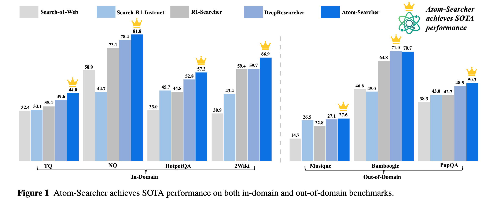
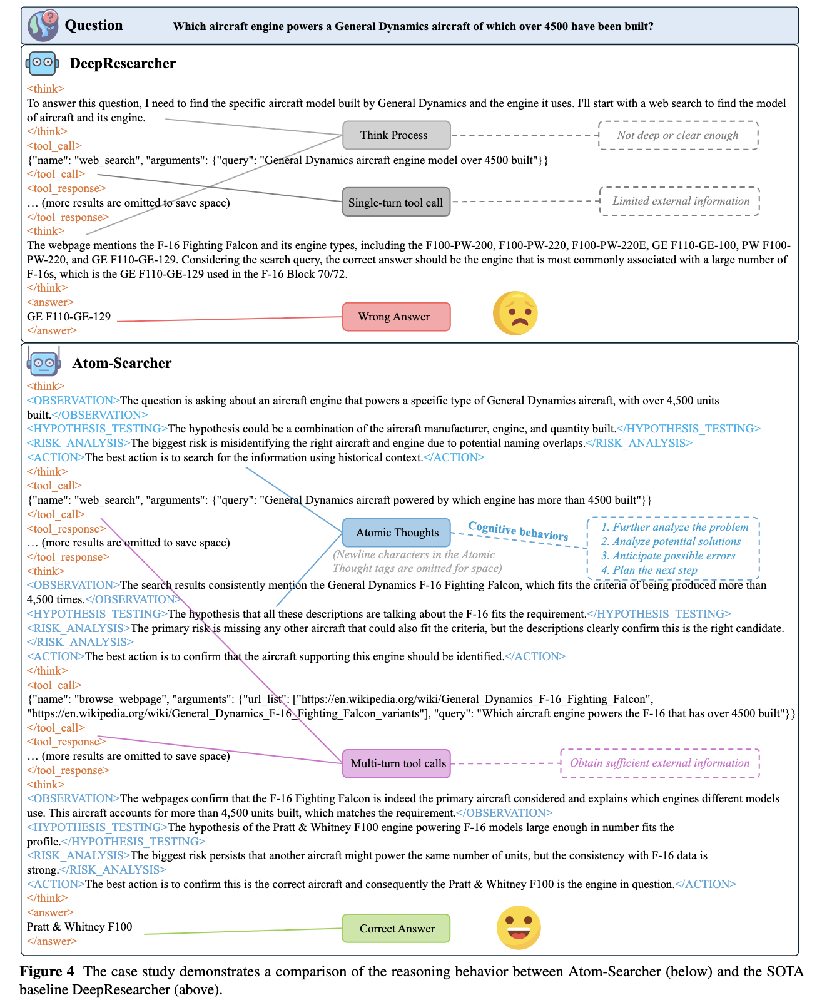

# ⚛️ Atom-Searcher: 通过细粒度原子化思想奖励增强智能体的深度研究能力

<p align="center">
<a href="https://arxiv.org/abs/2508.12800" target="_blank">

</a>
<a href=https://huggingface.co/dikw/Atom-Searcher" target="_blank">

</a>
<a href="https://github.com/antgroup/Research-Venus" target="_blank">

</a>
</p>


## 📖 引言

Atom-Searcher 是一个旨在增强大语言模型（LLMs）深度研究能力的新颖框架。尽管 LLMs 展现出巨大潜力，但其静态的内部知识限制了它们处理复杂、多步骤任务的能力。现有的方法，如检索增强生成（RAG）和基于结果的强化学习（RL），常常因其固化的工作流程、奖励稀疏性以及训练过程中的梯度冲突而表现不佳。

为克服这些挑战，我们引入了 **Atom-Searcher**，这是一个建立在**原子化思想（Atomic Thought）概念之上的全新强化学习框架。该范式将复杂的推理过程分解为细粒度的功能单元。每一个“原子化思想”都由一个推理奖励模型（Reasoning Reward Model, RRM）进行评估，从而提供细粒度的原子化思想奖励（Atomic Thought Reward, ATR）**，用以指导智能体的学习过程。

该框架采用了一种受课程学习启发的奖励机制，在初期优先奖励高质量的推理过程，随后再将重点转移到最终结果上，从而加速发现有效的问题解决策略。

Atom-Searcher 的主要优势包括：

  * **最先进的性能**：在七个不同的基准测试中，相较于现有模型均取得了一致的提升。
  * **增强的可解释性**：通过分解其思考过程，展现出更类似人类且易于理解的推理模式。
  * **高效的训练**：缓解了奖励稀疏性和梯度冲突问题，使策略优化更为高效。
  * **可扩展的计算能力**：在测试时能有效扩展其计算投入，以解决更复杂的查询。


<p align="center">

</p>


<p align="center">

</p>


# 概览

  * [主要亮点](https://www.google.com/search?q=%23key-highlights)
  * [评估](https://www.google.com/search?q=%23evaluation)
  * [引用](https://www.google.com/search?q=%23citation)

-----

# ✨ 主要亮点

我们推出了 **Atom-Searcher**，一个旨在提升智能体深度研究能力的框架。它通过优化推理过程本身，而不仅仅是最终结果，显著提高了 LLM 解决问题的能力。

-----

### 💡 引入“原子化思想”范式

我们提出了**原子化思想（Atomic Thought）**，这是一种新颖的思维范式，它将复杂的推理过程分解为细粒度的、可解释的功能单元。智能体不再生成一个单一、庞大的思想块，而是生成一系列原子化的思想，如 `<OBSERVATION>`（观察）、`<HYPOTHESIS_TESTING>`（假设检验）和 `<RISK_ANALYSIS>`（风险分析）。这种结构化的方法带来了：

  - ✅ 更类似人类、可解释且更深入的推理模式
  - ✅ 在测试时可扩展计算资源
  - ✅ 为推理奖励模型（RRM）提供监督锚点，将深度研究任务与 RRM 联系起来。

-----

### 🎯 结合细粒度奖励的过程监督强化学习

当前的智能体依赖于基于结果的强化学习（RL），但这种方法存在**奖励稀疏性**和**梯度冲突**的问题——即因为一个最终答案的错误而惩罚整个推理链。Atom-Searcher 通过以下方式解决此问题：

  - 🔹 **推理奖励模型（RRM）：** RRM 为每一个独立的原子化思想打分，提供密集的、细粒度的过程级奖励，我们称之为原子化思想奖励（ATR）。
  - 🔹 **课程学习式奖励策略：** 该框架动态平衡过程级 ATR 和最终结果奖励的权重。在训练初期，它优先鼓励良好的推理过程（ATR），随着智能体能力的提升，逐渐将重点转移到产出正确答案上。
  - 🔹 **高效优化：** 这种混合奖励结构缓解了奖励稀疏性问题，并引导智能体更快地发现有效的推理路径。

-----

### 🚀 SOTA 性能与可扩展的推理能力

我们通过大量实验证明，Atom-Searcher 在智能体深度研究领域树立了新的技术标杆（SOTA）。

  - 📈 在七个不同的基准测试中，它相较于 **DeepResearcher** 和 **R1-Searcher** 等强大的基线模型取得了显著的性能提升。
  - 🧠 在测试时，Atom-Searcher 能**有效地扩展其计算资源**，与 SOTA 基线模型相比，平均多生成 3.2 倍的 token 并多进行 1.24 倍的工具调用，这表明在没有明确激励的情况下，它也能进行更深度的探索和推理。


-----

## 评估

Atom-Searcher 的有效性在一系列多样化的开放域问答（QA）基准测试中得到了验证，共涵盖七个数据集。

### 在域内和域外基准测试上的主要结果

Atom-Searcher 的表现始终优于基于训练和基于提示的方法。所有分数均为 F1 分数。

| **类型** | **方法** | **NQ** | **TQ** | **HotpotQA** | **2Wiki** | **Musique** | **Bamboogle** | **PopQA** |
| :--- | :--- | :---: | :---: | :---: | :---: | :---: | :---: | :---: |
| 基于提示 | Search-al-Web | 32.4 | 58.9 | 33.0 | 30.9 | 14.7 | 46.6 | 38.3 |
| 基于训练 | Search-R1-Instruct | 33.1 | 44.7 | 45.7 | 43.4 | 26.5 | 45.0 | 43.0 |
| | R1-Searcher | 35.4 | 73.1 | 44.8 | 59.4 | 22.8 | 64.8 | 42.7 |
| | DeepResearcher | 39.6 | 78.4 | 52.8 | 59.7 | 27.1 | **71.0** | 48.5 |
| | **Atom-Searcher (我们的模型)** | **44.0** | **81.8** | **57.3** | **66.9** | **27.6** | 70.7 | **50.3** |

> 🔝 **实验结果表明，Atom-Searcher 在 7 个基准测试中的 6 个上取得了新的 SOTA 性能，与之前的 SOTA 模型 DeepResearcher 相比，在域内任务上平均提升了 8.5%，在域外任务上平均提升了 2.5%。**

### 消融实验

消融实验证实，**原子化思想**和\*\*推理奖励模型（RRM）\*\*对性能都至关重要。在没有结构化原子思想的情况下，仅添加 RRM 奖励所带来的收益微乎其微。

| **方法** | **NQ** | **TQ** | **HotpotQA** | **2Wiki** | **Musique** | **Bamboogle** | **PopQA** |
| :--- | :---: | :---: | :---: | :---: | :---: | :---: | :---: |
| 基线 (DeepResearcher) | 39.6 | 78.4 | 52.8 | 59.7 | 27.1 | 71.0 | 48.5 |
| + RRM | 40.1 | 78.2 | 53.5 | 60.0 | 25.7 | 70.5 | 48.8 |
| **Atom-Searcher (基线 + RRM + 原子化思想)** | **44.0** | **81.8** | **57.3** | **66.9** | **27.6** | **70.7** | **50.3** |

# 引用

如果您觉得我们的工作对您有用，请考虑引用：

```plain
@misc{deng2025atomsearcherenhancingagenticdeep,
      title={Atom-Searcher: Enhancing Agentic Deep Research via Fine-Grained Atomic Thought Reward}, 
      author={Yong Deng and Guoqing Wang and Zhenzhe Ying and Xiaofeng Wu and Jinzhen Lin and Wenwen Xiong and Yuqin Dai and Shuo Yang and Zhanwei Zhang and Qiwen Wang and Yang Qin and Changhua Meng},
      year={2025},
      eprint={2508.12800},
      archivePrefix={arXiv},
      primaryClass={cs.CL},
      url={https://arxiv.org/abs/2508.12800}, 
}
```